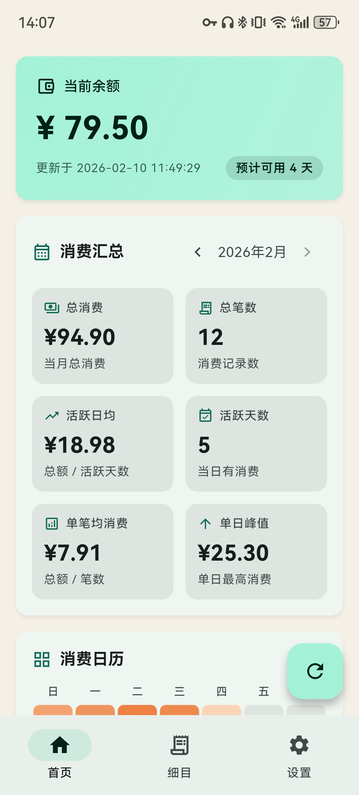

# nnez-yisu

`nnez-yisu` 是一个基于 Flutter 的南宁二中校园卡消费助手应用，遵循 Material Design 3 设计风格。

## 首页截图



## 主要功能

- 余额同步：刷新校园卡余额并记录更新时间
- 消费同步：拉取近 30 天消费流水并本地存储
- 充值同步：拉取充值记录（仅统计“支付成功”）
- 账户操作：挂失 / 解挂
- 数据管理：JSON 导入 / 导出
- 细目视图：
  - 月份 / 单日切换
  - 日历定位单日记录
  - 月份模式地点分类统计（正餐 / 饮品 / 小吃）
  - 记录图标按消费类别展示并显示机号
- 桌面组件：显示当前余额
- 自动刷新：应用内每 3 小时自动触发一次刷新
- 自动更新：
  - 启动时可自动检查更新
  - 支持镜像更新与 GitHub 更新
  - 更新包下载后自动拉起安装，后续自动清理安装包

## 技术栈与结构

- Flutter / Dart
- 本地存储：`shared_preferences` + `sqflite`
- 后台任务：`workmanager`
- 桌面组件：`home_widget`
- 更新能力：GitHub Releases + `open_filex`

核心目录：

- `lib/pages/`：页面层（首页、细目、设置、关于等）
- `lib/services/`：业务服务（同步、更新、导入导出、日志）
- `lib/models/`：数据模型
- `lib/core/`：公共工具与分类逻辑
- `.github/workflows/`：CI 构建流程

## 本地开发

```bash
flutter pub get
flutter analyze
flutter test
flutter run
```

## 构建与测试流程

### Android APK（自动 + 手动）

工作流：`.github/workflows/android-apk.yml`

- `main` 分支 push 自动触发
- 也可在 GitHub Actions 页面手动触发

### Windows 测试构建（仅手动）

工作流：`.github/workflows/windows-test-build.yml`

- 仅支持 `workflow_dispatch`（手动触发）
- 输出产物为 Windows 压缩包（解压后运行 `yisu.exe`）

## 开发现状说明

- 项目当前以 Android 为主要使用平台
- Windows 构建用于桌面测试与功能验证
- 校园接口依赖学校服务端行为（例如验证码、风控策略、字段变化），相关逻辑已做容错与日志记录

## 仓库

- GitHub: https://github.com/imbrby/nnez-yisu
